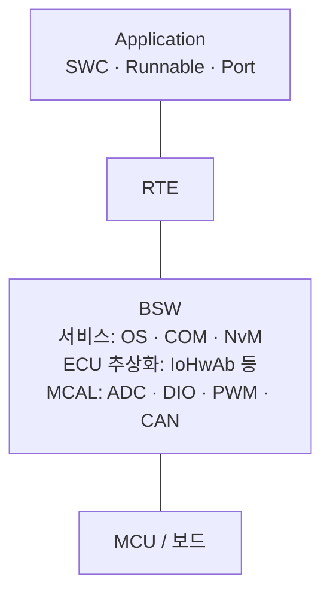

# AUTOSAR — 전자제어기 SW 실습

HINT 교육과정의 AUTOSAR 실습 자료입니다. Mobilgene에서 SWC와 BSW를 설정하고, RTE를 통해 애플리케이션 코드와 연결했습니다.
OS Task에서 시작해 SWC 간 통신, 하드웨어 입출력, CAN, 비휘발성 메모리, TORCS 연동까지 9개 실습을 순서대로 진행했습니다.

## 개발 환경

| 항목 | 내용 |
|---|---|
| 보드 / MCU | TRK-MPC5606B / NXP MPC5606B |
| 설정·코드 생성 | Mobilgene Studio |
| 빌드 | SCons + CodeWarrior 컴파일러 |
| 다운로드·디버깅 | CodeWarrior |
| 플랫폼 | AUTOSAR Classic 교육용 프로젝트 |
| 응용 실습 | TORCS 연동 CC·LKAS 예제 |

## AUTOSAR 기본 구조

AUTOSAR Classic은 Application, RTE, BSW로 구성됩니다. MCAL은 BSW에 포함되며, MCU 주변장치에 접근하는 드라이버 계층입니다.



| 용어 | 역할 |
|---|---|
| SWC | 입력 처리나 제어 기능을 담당하는 소프트웨어 컴포넌트 |
| Runnable | SWC 내부에서 Event에 의해 실행되는 함수 단위 |
| Port | SWC가 데이터를 주고받거나 서비스를 호출하는 접점 |
| RTE | SWC 간 통신과 BSW 서비스 접근을 연결하는 실행 환경 |
| BSW | OS·통신·메모리·하드웨어 접근 등 공통 기능을 제공하는 기반 소프트웨어 |
| MCAL | ADC·DIO·PWM·CAN 등 MCU 주변장치를 다루는 드라이버 계층 |

01~02는 OS, 03~05는 RTE, 06은 입출력, 07은 CAN, 08은 NvM, 09는 응용 통합을 중심으로 다룹니다.

## 개발 흐름

```text
Mobilgene에서 SWC·RTE·BSW 설정 + Runnable 코드 작성
    → 코드 생성: generate.py를 통해 RTE·BSW·MCAL 생성
    → SCons 빌드: CodeWarrior 컴파일러로 컴파일·링크 → ELF
    → CodeWarrior에서 ELF 다운로드·디버깅
    → 보드 동작 확인
```

설정·모델은 `Configuration/`, Runnable 구현은 `Static_Code/`에 있습니다.
`Build/`의 SCons 스크립트가 코드 생성과 컴파일·링크를 연결하며, 생성 결과는 `Generated/`에 배치됩니다.

## 보드 핀 구성

| 장치 | MCU 핀 | 주요 사용 |
|---|---|---|
| S1 | PE0 | 05의 디지털 입력 |
| LED1 | PE4 | 03~05 출력, 06~07 난방 동작 상태 |
| LED2 | PE5 | 01~02 Task 실습, 06~07 Alive 표시 |
| LED4 | PE7 | 06~07 PWM으로 난방 강도 표현 |
| 가변저항 | PB4 | 06~07 ADC 입력으로 난방 단계 선택 |

## 실습 목록

| No | 폴더 | 내용 | 핵심 개념 |
|---|---|---|---|
| 01 | [OS 비주기 Task](01_OS_비주기_Task) | 시작 시 LED2를 초기화하고 Task 종료 | Task 설정, `ActivateTask()`, `TerminateTask()` |
| 02 | [OS 주기 Task](02_OS_주기_Task) | Alarm으로 LED2 상태를 1초마다 전환 | Counter, Alarm, 주기 Task |
| 03 | [RTE Timing Event](03_RTE_Timing_Event) | 100 ms마다 Runnable을 실행해 LED1 토글 | SWC, Runnable, Event–Task 매핑 |
| 04 | [RTE Sender/Receiver](04_RTE_Sender_Receiver) | 모의 승객 감지 값을 SWC 간에 전달해 LED1 제어 | S/R 인터페이스, `Rte_Write/Read`, Data Received Event |
| 05 | [RTE Client/Server](05_RTE_Client_Server) | S1 입력과 LED1 출력을 RTE 서비스 호출로 연결 | C/S 인터페이스, `Rte_Call`, 포트 연결 |
| 06 | [IoHwAb](06_IoHwAb) | 다이얼 입력으로 난방 단계와 LED 밝기 제어 | ADC·DIO·PWM, IO 추상화, Queued S/R |
| 07 | [CAN](07_CAN) | CAN 승객 감지 신호를 난방 제어에 연결 | DBC Import, COM 신호, CAN–RTE 연동 |
| 08 | [MEMORY](08_MEMORY) | NvM 블록의 읽기·쓰기와 완료 통지 연결 | RAM 블록, NvM 서비스, 비동기 처리 |
| 09 | [Application](09_Application) | CC·LKAS SWC와 TORCS CAN 신호 연결 | SWC 구성, 100 ms Runnable, ECU 통합 |

## 폴더 구성

```text
각 실습 폴더/
├─ Configuration/
│  ├─ ECU/          # ECU·MCAL 설정
│  └─ System/       # SWC·Composition·데이터 타입·CAN 모델
├─ Static_Code/     # 실습 관련 C 코드 또는 구현 설명
├─ Generated/       # 실습에서 사용하는 서비스 SWC 모델
└─ Build/           # SWC 생성 입력을 등록한 generate.py
```

실습별 설정·구현과 필요한 서비스 모델을 포함했습니다. 09의 `App_CC.c`, `App_LKAS.c`는 실습 폴더 최상위에 있습니다.
교육용 기본 프로젝트와 제공 예제를 바탕으로 한 자료이며, 전체 빌드에는 원본 툴체인과 플랫폼 코드가 필요합니다.
