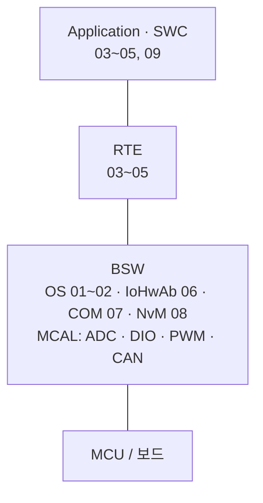

# AUTOSAR — 전자제어기 SW 실습

HINT 교육과정의 AUTOSAR 실습 자료입니다. Mobilgene에서 SWC와 BSW를 설정하고, RTE를 통해 애플리케이션 코드와 연결했습니다.
OS Task에서 시작해 SWC 간 통신, 하드웨어 입출력, CAN, 비휘발성 메모리, TORCS 연동까지 9개 실습을 순서대로 진행했습니다.

## 개발 환경

| 항목 | 내용 |
|---|---|
| 보드 / MCU | TRK-MPC5606B / NXP MPC5606B |
| 설정·코드 생성 | Mobilgene Studio |
| 빌드·디버깅 | SCons + CodeWarrior |
| 플랫폼 | AUTOSAR Classic 교육용 프로젝트 |
| 시뮬레이터 | TORCS (09 CC·LKAS 연동) |

## AUTOSAR 기본 구조

AUTOSAR Classic은 Application, RTE, BSW 세 계층으로 나뉩니다. 각 계층 아래에 해당 실습 번호를 적었습니다.



- **SWC** : 입력 처리나 제어 기능을 담당하는 소프트웨어 컴포넌트
- **Runnable** : SWC 안에서 Event에 의해 실행되는 함수
- **Port** : SWC가 데이터를 주고받거나 서비스를 호출하는 접점
- **RTE** : SWC 사이의 통신과 BSW 서비스 호출을 연결하는 계층
- **BSW** : OS·통신·메모리·입출력 등 공통 기능을 제공하는 기반 소프트웨어
- **MCAL** : BSW의 가장 아래에서 MCU 주변장치를 다루는 드라이버 계층

## 실습 목록

### 1. OS

| No | 폴더 | 내용 | 핵심 개념 |
|---|---|---|---|
| 01 | [OS 비주기 Task](01_OS_비주기_Task) | 시작 시 LED2를 초기화하고 Task 종료 | `ActivateTask()`, `TerminateTask()` |
| 02 | [OS 주기 Task](02_OS_주기_Task) | Alarm으로 1초마다 LED2 전환 | Counter, Alarm, 주기 Task |

### 2. RTE

| No | 폴더 | 내용 | 핵심 개념 |
|---|---|---|---|
| 03 | [RTE Timing Event](03_RTE_Timing_Event) | 100 ms마다 Runnable을 실행해 LED1 토글 | SWC, Runnable, Event–Task 매핑 |
| 04 | [RTE Sender/Receiver](04_RTE_Sender_Receiver) | 모의 승객 감지 값을 SWC 간에 전달해 LED1 제어 | S/R 인터페이스, Data Received Event |
| 05 | [RTE Client/Server](05_RTE_Client_Server) | S1 입력과 LED1 출력을 RTE 서비스 호출로 연결 | C/S 인터페이스, `Rte_Call` |

### 3. BSW 연동과 응용 통합

| No | 폴더 | 내용 | 핵심 개념 |
|---|---|---|---|
| 06 | [IoHwAb](06_IoHwAb) | 다이얼 입력으로 난방 단계와 LED 밝기 제어 | ADC·DIO·PWM, IO 추상화 |
| 07 | [CAN](07_CAN) | CAN 승객 감지 신호를 난방 제어에 연결 | DBC Import, COM 신호 |
| 08 | [MEMORY](08_MEMORY) | NvM 블록의 읽기·쓰기와 완료 통지 연결 | NvM 서비스, 비동기 처리 |
| 09 | [Application](09_Application) | TORCS CAN 신호를 CC·LKAS SWC에 연결 | SWC 구성, ECU 통합 |

## 프로젝트 구성

```text
Mobilgene 설정 → generate.py로 코드 생성 → SCons 빌드 → CodeWarrior 다운로드·디버깅
```

```text
각 실습 폴더/
├─ Configuration/   # ECU·MCAL 설정, SWC·Composition·CAN 모델
├─ Static_Code/     # Runnable 구현 C 코드 또는 구현 설명
├─ Generated/       # 실습에서 사용하는 서비스 SWC 모델
└─ Build/           # 코드 생성 입력을 등록한 generate.py
```

- 실습에 필요한 설정과 구현만 포함했습니다. 09의 `App_CC.c`, `App_LKAS.c`는 실습 폴더 최상위에 있습니다.
- 교육용 기본 프로젝트와 제공 예제를 바탕으로 한 자료이며, 전체 빌드에는 원본 툴체인과 플랫폼 코드가 필요합니다.
